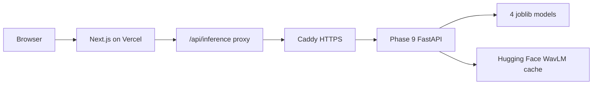

# Deploy Phase 9 Backend on DigitalOcean + Vercel Frontend

This guide deploys the active Phase 9 backend in `new backend/release/`.
Do not deploy the legacy `inference_api/` service for the current app.

## Target Architecture



The browser calls the Vercel app. Vercel forwards `/api/inference/*` to the DigitalOcean API using `INFERENCE_PROXY_TARGET`.

## 1. Claim DigitalOcean Credit

1. Open [GitHub Student Developer Pack](https://education.github.com/pack).
2. Claim the DigitalOcean offer.
3. In DigitalOcean billing, confirm the $200 credit is visible before creating paid resources.
4. Add a billing alert so you do not keep paying after the project/demo period.

DigitalOcean has announced that GitHub Student Pack credits expire on July 31, 2026. Delete paid resources before then if you do not want normal billing.

## 2. Create the Droplet

Recommended settings:

| Setting | Value |
| --- | --- |
| Image | Ubuntu 24.04 LTS |
| Size | 4 GB RAM / 2 vCPU minimum |
| Region | Closest to your audience |
| Authentication | SSH key |
| Firewall | Allow 22, 80, 443 |

Do not expose port `8000` publicly for the final setup. Caddy will expose HTTPS on `443` and reverse-proxy to the API container.

## 3. Point a Domain to the Droplet

Create an `A` record:

```text
api.yourdomain.com -> YOUR_DROPLET_IP
```

You can use DigitalOcean DNS, Cloudflare, or another DNS provider.

For quick testing only, you may temporarily skip the domain and expose port `8000`, but Vercel production should use HTTPS.

## 4. Prepare the Droplet

SSH into the Droplet:

```bash
ssh root@YOUR_DROPLET_IP
```

Install Docker and Git:

```bash
apt update
apt install -y docker.io docker-compose-plugin git
systemctl enable --now docker
```

Clone your repo:

```bash
git clone https://github.com/YOUR_GITHUB_USER/FASSD.git /opt/fassd
cd "/opt/fassd/new backend/release"
```

Copy the production env template:

```bash
cp .env.production.example .env.production
nano .env.production
```

Set:

```bash
CADDY_DOMAIN=api.yourdomain.com
CORS_ALLOW_ORIGINS=https://your-app.vercel.app
HF_HUB_DISABLE_SYMLINKS_WARNING=1
```

Optional if Hugging Face downloads are slow or rate-limited:

```bash
HF_TOKEN=hf_your_token_here
```

## 5. Upload the Phase 9 Models

The live backend expects these files:

```text
new backend/release/models/origin/origin_file_model__ssl__experimental.joblib
new backend/release/models/replay/replay_file_model__acoustic__experimental.joblib
new backend/release/models/mixer/mixer_file_model__acoustic__experimental.joblib
new backend/release/models/partial_segment/partial_segment_model__combined__experimental.joblib
```

These `.joblib` files are not in the current git checkout, so upload the whole `models` folder from your local machine.

From Windows PowerShell on your computer:

```powershell
scp -r "D:\FASSD\new backend\release\models" root@YOUR_DROPLET_IP:"/opt/fassd/new backend/release/"
```

After upload, verify on the Droplet:

```bash
cd "/opt/fassd/new backend/release"
find models -name "*.joblib" -maxdepth 3
```

You should see the four active model files listed above.

## 6. Start the Backend

On the Droplet:

```bash
cd "/opt/fassd/new backend/release"
docker compose up -d --build
```

First startup can take several minutes because the API warms the joblib models and downloads WavLM from Hugging Face.

Watch logs:

```bash
docker compose logs -f api
```

Check container status:

```bash
docker compose ps
```

Verify health:

```bash
curl https://api.yourdomain.com/health
```

Expected once warm:

```json
{
  "status": "ok",
  "models_loaded": true,
  "ssl_warmed": true,
  "ready_for_analyze": true
}
```

## 7. Deploy the Frontend on Vercel

1. Push the repo to GitHub.
2. Open [Vercel](https://vercel.com).
3. Import the repo.
4. Use the repository root as the project root, where `package.json` lives.
5. Add environment variables:

| Variable | Value |
| --- | --- |
| `INFERENCE_PROXY_TARGET` | `https://api.yourdomain.com` |
| `NEXT_PUBLIC_FIREBASE_API_KEY` | Firebase project value |
| `NEXT_PUBLIC_FIREBASE_AUTH_DOMAIN` | Firebase project value |
| `NEXT_PUBLIC_FIREBASE_PROJECT_ID` | Firebase project value |
| `NEXT_PUBLIC_FIREBASE_STORAGE_BUCKET` | Firebase project value |
| `NEXT_PUBLIC_FIREBASE_MESSAGING_SENDER_ID` | Firebase project value |
| `NEXT_PUBLIC_FIREBASE_APP_ID` | Firebase project value |

Do not set `NEXT_PUBLIC_INFERENCE_URL` for the recommended setup. Leaving it unset makes the browser call Vercel's same-origin `/api/inference` proxy.

Deploy the Vercel app.

## 8. Firebase Setup

In Firebase Console:

1. Open Authentication -> Settings -> Authorized domains.
2. Add your Vercel domain, for example:

```text
your-app.vercel.app
```

3. Confirm Firestore rules are published if history saving is enabled.

## 9. End-to-End Test

Open:

```text
https://your-app.vercel.app/dashboard
```

Upload a short `.wav` or `.mp3`.

Expected:

- The Vercel app calls `/api/inference/analyze`.
- Vercel proxies to `https://api.yourdomain.com/analyze`.
- Backend returns `processing_status: "ok"`.
- The UI shows Phase 9 evidence axis cards and waveform segment highlights.

If it fails, check:

```bash
docker compose logs -f api
curl https://api.yourdomain.com/health
```

## Common Issues

| Symptom | Likely cause | Fix |
| --- | --- | --- |
| `ready_for_analyze: false` | WavLM still downloading or failed | Wait, check logs, set `HF_TOKEN` if rate-limited |
| `Phase 9C models not loaded` | Missing `.joblib` files | Re-upload `models/` from local machine |
| Vercel 502 | Wrong `INFERENCE_PROXY_TARGET` or API blocked | Check Vercel env var, DNS, firewall, Caddy logs |
| Browser CORS error | `NEXT_PUBLIC_INFERENCE_URL` was set | Remove it and use `INFERENCE_PROXY_TARGET` instead |
| `phase8f_fusion_rules` missing | Old backend code deployed | Pull latest repo with `src/phase8_fusion/` |
| Slow first scan | WavLM/model warmup | Use `/health` and wait for `ready_for_analyze: true` |

## Shutdown to Avoid Billing

When the demo is done:

```bash
docker compose down
```

To stop DigitalOcean billing completely, destroy the Droplet in the DigitalOcean control panel.
